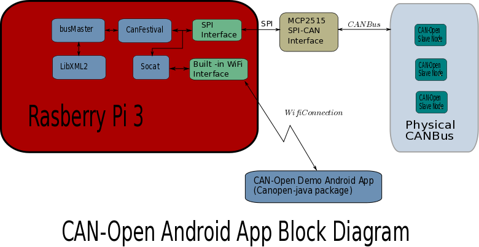

# canopen-raspberrypi
##Background
Have you ever needed an inexpensive control system to control a water fountain or animated haunted house display?  CAN-Bus 
and CAN-Open were designed for applications like this.  While the most common place to find CAN-Bus is in your car's 
[OBDII interface](http://pinoutsguide.com/CarElectronics/car_obd2_pinout.shtml), it isn't used too much in low cost control systems
because of the high cost hardware.  

[CAN-Open](http://www.can-cia.org/index.php?id=canopen) is protocol that sits above the [CAN-Bus Physical/Data layer](http://www.can-cia.org/index.php?id=systemdesign-can-physicallayer), 
but it can also sit above other data layers.  By a using a clever tool such as [socat](http://linux.die.net/man/1/socat), 
we can route CAN-Bus data traffic onto a datagram port, allowing devices such as cell phones and tablets direct access to the 
CAN-Bus data layer.  

This project aims to create a low cost CAN-bus to wifi interface on a RaspberryPi, see the block diagram below.  The Pi allows an Android apps to connect to the can bus and
directly send and recieve messages.  Additionally, a bus master application runs on the PI to configure nodes on a CAN-Open network.
The project has been broken down into several sub projects;
 - Setup of socat to route a CAN-Bus interface to a UDP port
 - [A CANOpen java library](https://github.com/Awalrod/CanOpenJavaLibrary)
 - [An Android app](https://github.com/Awalrod/AndroidCanOpenDemo)
 - A CanFestival Bus master to configure slave nodes

The magic of the project is socat. This tool makes CAN-Bus interface available on a UDP port.  Once the CAN-Bus is available 
on a UDP port, any number of devices may connect to it through any Internet style interface (Ethernet, Wifi,...).  

#Hardware you will need
##Raspberry Pi 3
Other versions of Pi's can be made to work, but the magic bullet for us was the built 
in Wifi interface on the Pi 3.  The wifi hotspot integration is picky about which wifi hardware is used.  We were not able
get it to work with a Edimax N150 USB dongle.  We aren't saying it can't be done, it just worked when we used the Pi 3's internal
Wifi interface.
## An SPI/CAN bus card
We initially used the [PiCan2](http://skpang.co.uk/catalog/pican2-canbus-board-for-raspberry-pi-2-p-1475.html), which uses 
the [Microchip MCP2515](http://www.microchip.com/wwwproducts/en/MCP2515) "Stand-Alone CAN Controller with SPI Interface".  
During later development we used our own in-house boards with the same IC.  This IC is pretty well supported with the 
RasberryPI linux distrobution.
## CAN-Open slave nodes
These things are availble, but are pretty expensive.  We rolled our own.  Llook for blatent product plug here in the
near future.  Many embedded microcontrollers have CAN-Bus interfaces on them.  There don't seem to be many CAN-Open 
stacks available that support them.  Again, we rolled our own.  Until we can support selling low cost nodes, good luck to you!
##An Android tablet with Wifi
We developed our app with two different tablets, A Samsung Galaxy Tab 4, and a Boox e-ink device.  The Boox e-ink device has a 
slow screen update rate and is B&W, but it works awesomely when using it in the full sun.

# Setting up the Raspberry Pi Can Bus Interface
From a fresh Raspberry Pi install, install the following packages

	sudo apt-get update 
	sudo apt-get dist-upgrade
	sudo apt-get install joe can-utils hostapd udhcpd rsync socat git
	sudo raspi-config
		enable spi 
		expand filesystem
		enable i2c
		set hostname

to setup the can bus interface
	sudo joe /boot/config.txt

Add these 3 lines to the end of file:

	# can-bus see interface http://skpang.co.uk/blog/archives/1165 for details 
	dtoverlay=mcp2515-can0,oscillator=16000000,interrupt=25 
	dtoverlay=spi-bcm2835

This will install the basic packages to allow you to bring up a can0 interface on the mcp2515 spi-can interface chip.  The 
can0 interface is used with socat to allow wifi connections to the canbus interace

# Setting up the socat server
run `./runsocat.sh` from ~/canopen-raspberrypi which will bring up the interface and start a session of 
socat to put can0 on port 2000.  Verify that can0 is up with `ifconfig`

# Wifi hotspot configuration
Setting up the wifi hotspot on the rasberry pi is beyond the scope of this project.  An excellent tutorial is 
given at [RPI-Wireless-Hotspot](http://elinux.org/RPI-Wireless-Hotspot). You can ignore setting up the dns tools 
if the Pi will not be connecte to the internet.

#Packages needed to use CanFestival
The bus master software uses CanFestival, it will need to be installed in order to compile.
Other packages that you will need to edit and compile CanFestival applications
 - python-wxgtk2.8 python-wxglade,  to use the python ObjDict editor in CanFestival
 - diffuse, a nice gui text diffing tool
 - libxml2-dev, required to compile the busMaster tool later on
All of these packages can be installed with the standard `sudo apt-get install <pkg-name>` syntax

# Installing canfestival socket drivers
Get the [Canfestival code](https://github.com/cmjonze/canfestival).
 - git https://github.com/cmjonze/canfestival
 - cd canfestival
 - ./configure --arch=arm32 --can=socket
 - make
 - sudo make install

# busMaster
CAN-Open is a distributed internodal communications system.  A master/slave relationship exists in CAN-Open parlance, but 
the master is more of a dynamic information repository and state transition tool than it is a true *master* 
even though it can act like one.  This busMaster tool relies heavily on CanFestival for the underlying 
CAN-Open infrastructure.  

The busMaster software does a few things.
 - it configures the dynamic information on the system when a new node comes online.  The dynamic information is contained in config.xml
 - it sends out periodic sync signals
 - it puts nodes into the operational state once configured

To add nodes to the bus unfortunatly, busMaster must be edited and recompiled with the new node ID.  This requires the 
use of wxWidgets to add the correct SDO parameters.

#to start canopen bus master
	.../busMaster
	./run.sh

#Android app
The Android app is used to control and monitor nodes on the can bus.  It is a slave device which the busMaster configures when connected.
This most excellent package is available at [Android CAN-Open Demo] (https://github.com/Awalrod/AndroidCanOpenDemo)

#CAN-Open-Java
This package is used by the android app, but is kept separate because it is usefull as a generic java package.  
This package can be found [here](https://github.com/Awalrod/CanOpenJavaLibrary)

